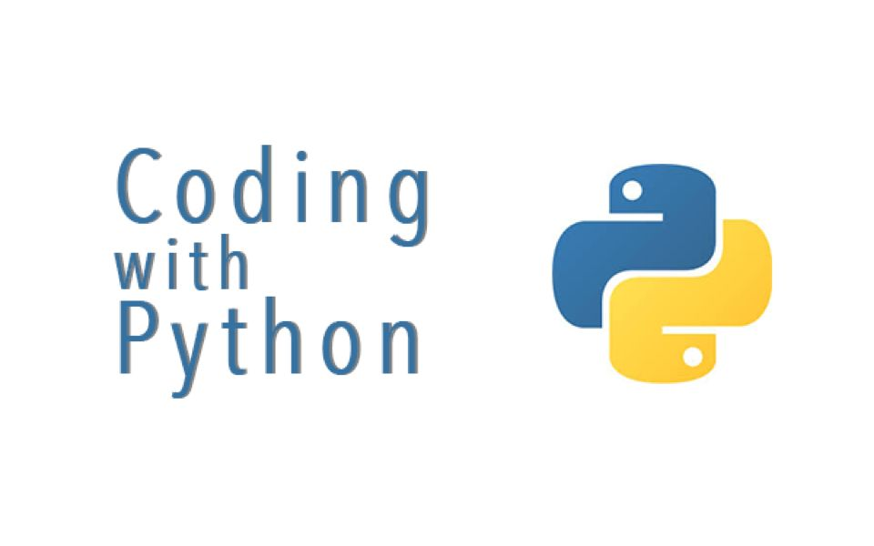

 # <center>Python-UseFul<center/>
<p align = "center"> 

</p>

**Python-UseFul** 希望可以帮助到更多的人，无论是初学者还是项目老手

 

创建这个项目的目的是为了更好更快的让人使用Python3的一些用法，将Python3语言中的特点更方便应用于Python构建的项目中。  
- 针对Python3语言中常用方法总结，方便快速部署  
- 常用库的使用和举例  
- 功能更容易迁移到其他项目中 
- 每种方法给出简易用例，方便应用在其他项目中并易于扩展

### 特别说明
> [!说明]\
> 所有代码均多数来自互联网，仅供学习和参考使用。
> 如果你觉得有用请引用出处，让开源更加开源。
> 如果有用也可请分享给有需要的人。
> 真心希望此项目能帮助到更多的人。
>


### 依赖库安装命令
```shell
pip install -r requirements.txt
```

### 举例:
<details>
<summary>装饰器</summary>

```python
import time

# 计时函数装饰器
def timer(func):
    def wrapper(*args, **kwargs):
        start_time = time.time()
        result = func(*args, **kwargs)
        end_time = time.time()
        print(f"{func.__name__} took {end_time - start_time:.2f} seconds to "
              "execute.")
        return result
    return wrapper

# 测试计时
@timer
def test_record_runtime():
    s = 0
    for i in range(100000):
        s += 1


if __name__ == '__main__':
    test_record_runtime()
```
</details>

<details>
<summary>文件操作(举例)</summary>

```python
import os
import shutil
from tqdm import tqdm
from enum import Enum


class File_Type(Enum):
    ...


class File_OP():
    ...


# 测试一
def test_findfile():
    ...


# 测试二
def test_copyfiles():
    ...


if __name__ == '__main__':
    test_findfile()
    test_copyfiles()
```
</details>

<details>
<summary>多字段排序</summary>

```python
some code ...
```
</details>

<details>
<summary>map/reduce/filter</summary>

```python
some code ...
```
</details>

<details>
<summary>内置数据格式</summary>

```python
some code ...
```
</details>

<details>
<summary>collections模块</summary>
一定要像熟悉内置关键词一样熟悉的模块

```python
some code ...
```
</details>

<details>
<summary>functools模块</summary>
一定要像熟悉内置关键词一样熟悉的模块

```python
some code ...
```
</details>

 
<details>
<summary>协程asyncio</summary>
python3的功能，以python3.8为例，python3.10之后取消yield实现协程功能。

```python
some code ...
```
</details>

### 更多模块(非常优秀的模块)

<details open>
<summary>
sqlite3
</summary>

[sqlite3](https://sqlite.org/index.html): SQLite 是一个由 C 语言编写的库，它提供了一个轻量级的基于磁盘的数据库，不需要单独开一个数据库服务器，并允许使用 SQL 语句访问数据库。

判断是否使用 SQLite 的标准：

1. 数据与应用分离：不适用 SQLite
2. 要求高并发性：不适用 SQLite
3. 大数据：不适用 SQLite
- 否则，选择 SQLite

</details>

<details open>
<summary>
streamlit
</summary>

[streamlit](https://streamlit.io/): A fast way to build and share data apps.Streamlit is an open-source Python framework for data scientists and AI/ML engineers to deliver interactive data apps – in only a few lines of code.

</details>

<details open>
<summary>
Gradio模块
</summary>

[Gradio](https://www.gradio.app/ "Gradio 方便部署你的Web UI快速展示后端功能")：
Python中还拥有着非常多的、方便使用的模块，项目收集的一些模块放在Utils中，可以参考快速实现一些功能原型。最近发现了一个Web UI相关的模块，

</details>

<details open>
<summary>
Boken模块
</summary>

[Boken](https://docs.bokeh.org/en/latest/docs/user_guide.html#userguide "交互式可视化web图表")：
Bokeh is a Python library for creating interactive visualizations for modern web browsers. It helps you build beautiful graphics, ranging from simple plots to complex dashboards with streaming datasets. With Bokeh, you can create JavaScript-powered visualizations without writing any JavaScript yourself.
</details>

<details open>
<summary>Pytorch</summary>

[Pytorch](https://pytorch.org  "交互式可视化web图表")：
是一个开源的Python机器学习库，基于Torch，用于自然语言处理等应用程序。PyTorch既可以看作加入了GPU支持的numpy，同时也可以看成一个拥有自动求导功能的强大的深度神经网络。除了Facebook外，它已经被Twitter、CMU和Salesforce等机构采用深度学习库，
</details>

<details open>
<summary>Faiss</summary>

[Faiss](https://github.com/facebookresearch/faiss "高效向量检索")：
Faiss的全称是Facebook AI Similarity Search。
这是一个开源库，针对高维空间中的海量数据，提供了高效且可靠的检索方法。
暴力检索耗时巨大，对于一个要求实时人脸识别的应用来说是不可取的。
而Faiss则为这种场景提供了一套解决方案。

</details>

<details open>
<summary>Pandas</summary>

[Pandas](https://pandas.pydata.org/ "高效数据处理库")：
pandas is a fast, powerful, flexible and easy to use open source data analysis and manipulation tool,
built on top of the Python programming language.

2024-5-9: pyinstaller打包pandas 2.2.2时出错，打包2.0.2通过

</details>

<details open>
<summary>Flask</summary>

[Flask](https://flask.palletsprojects.com/en/3.0.x/ "web服务端框架")：
FlasFastAPIk是一个使用Python编写的轻量级Web应用框架。它被设计为易于使用和扩展，使得开发者可以快速搭建基本的Web应用，同时也能够构建复杂的系统。

官方文档比较难懂，可以参考[Flask中文站](https://flask.github.net.cn/)

</details>

<details open>
<summary>FastAPI</summary>

[FastAPI](https://github.com/fastapi/fastapi "web服务端框架")：
FastAPI 从2025年开始，增长迅速，类型检查严格的框架，自动生成API的DOC文档，未来可期。

</details>

<details open>
<summary>Pyinstaller</summary>

[Pyinstaller](https://pyinstaller.org/ "桌面打包应用")：

PyInstaller bundles a Python application and all its dependencies into a single package. The user can run the packaged app without installing a Python interpreter or any modules. PyInstaller supports Python 3.8 and newer, and correctly bundles many major Python packages such as numpy, matplotlib, PyQt, wxPython, and others.

[Ref doc](https://pyinstaller.org/en/stable/)

</details>

<details open>
<summary>PyQt5</summary>

[PyQt5](https://www.riverbankcomputing.com/software/pyqt/ "跨平台桌面级应用")：

Qt is set of cross-platform C++ libraries that implement high-level APIs for accessing many aspects of modern desktop and mobile systems. These include location and positioning services, multimedia, NFC and Bluetooth connectivity, a Chromium based web browser, as well as traditional UI development.

PyQt5 is a comprehensive set of Python bindings for Qt v5. It is implemented as more than 35 extension modules and enables Python to be used as an alternative application development language to C++ on all supported platforms including iOS and Android.

PyQt5 may also be embedded in C++ based applications to allow users of those applications to configure or enhance the functionality of those applications.
</details>

<details open>
<summary>SQLAlchemy</summary>

[SQLAlchemy](https://docs.sqlalchemy.org/en/20/orm/quickstart.html#declare-models) is the Python SQL toolkit and Object Relational Mapper that gives application developers the full power and flexibility of SQL. SQLAlchemy provides a full suite of well known enterprise-level persistence patterns, designed for efficient and high-performing database access, adapted into a simple and Pythonic domain language.

[SQLAlchemy official github](https://github.com/sqlalchemy/sqlalchemy)
</details>

<details open>
<summary>NetworkX</summary>

NetworkX是一个用Python语言开发的库，它提供了丰富的工具，用于创建、操作和研究复杂网络的结构、动态和功能。

无论你是想分析互联网的链接结构，研究社交网络中的信息传播，还是探索交通网络的最优路径，NetworkX都能助你一臂之力。

[NetworkX Github](https://github.com/networkx/networkx)
</details>


<details open>
<summary>Streamlit</summary>

[Streamlit](https://docs.streamlit.io/)一个方便数据前端可视化及操作的框架库，简介好用，易开发。
</details>

<details open>
<summary>uv</summary>

[uv](https://uv.doczh.com/)一个用 Rust 编写的极速 Python 包和项目管理工具。非常好用的环境管理工具。
</details>

<details open>
<summary>zensical</summary>

[zensical](https://zensical.org/)开源的静态网页构建工具，方便、简单、实用。
</details>

<details open>
<summary>pillow_heif </summary>

> [pillow_heif](https://github.com/bigcat88/pillow_heif) 高效处理heic/heif/avif 等图片格式

</details>


[Pythhon 趋势](https://blog.jetbrains.com/zh-hans/pycharm/category/tutorials/) 一系列不错的文章，深受启发

### 记在最后:
- 项目代码管理：以 git 方式管理，同步代码更方便。[git代码至Github](https://blog.csdn.net/qq_24990383/article/details/127608245 "CSDN")
- 关于[markdown](https://www.markdownguide.org/ "markdown官网")：.md 是一个很方便的结构说明文档，项目说明中需要采用。