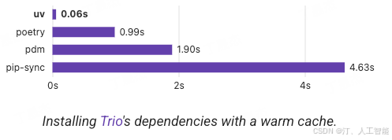

 # <center>Python UV<center/>
<p align = "center"> 

</p>
> [!IMPORTANT]
> - An extremely fast Python package and project manager, written in Rust.
 
<p align = "center"> 

</p>
> [!TIPS]
> - Figure for efficient.

- uv python install: Install Python versions.
- uv python list: View available Python versions.
- uv python find: Find an installed Python version.
- uv python pin: Pin the current project to use a - specific Python version.
- uv python uninstall: Uninstall a Python version.

Executing standalone Python scripts, e.g., example.py.

- uv run: Run a script.
- uv add --script: Add a dependency to a script
- uv remove --script: Remove a dependency from a script

## Projects

- uv init: Create a new Python project.
1. uv init --package example-pkg
- uv add: Add a dependency to the project.
- uv remove: Remove a dependency from the project.
- uv sync: Sync the project's dependencies with the environment.
- uv lock: Create a lockfile for the project's dependencies.
- uv run: Run a command in the project environment.
- uv tree: View the dependency tree for the project.
- uv build: Build the project into distribution archives.
- uv publish: Publish the project to a package index.

## Tools

uvx / uv tool run: Run a tool in a temporary environment.
- uv tool install: Install a tool user-wide.
- uv tool uninstall: Uninstall a tool.
- uv tool list: List installed tools.
- uv tool update-shell: Update the shell to include tool executables.

## Change pip env to uv
1. freeze env package
```shell
pip freeze > requirements.txt
```
2. uv env package
```shell
uv pip inastall requirements.txt
```