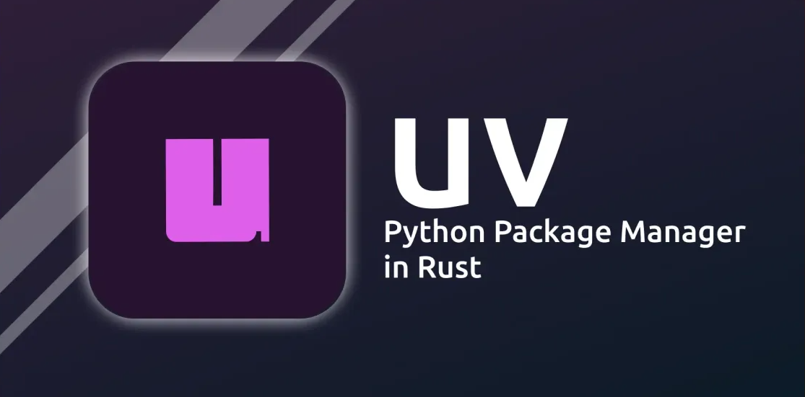
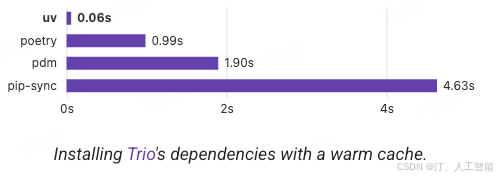

 # <center>Python UV<center/>
<p align = "center"> 

</p>
> [!IMPORTANT]
> - An extremely fast Python package and project manager, written in Rust.
 
<p align = "center"> 

</p>
> [!TIPS]
> - Figure for efficient.

- uv python install: Install Python versions.
```shell
// e.g.
uv python install 3.11
``` 
- uv python list: View available Python versions.
- uv python find: Find an installed Python version.
- uv python pin: Pin the current project to use a - specific Python version.
```shell
// e.g.
uv python pin 3.13
``` 
- uv python uninstall: Uninstall a Python version.
Executing standalone Python scripts, e.g., example.py.

- uv run: Run a script.
- uv add --script: Add a dependency to a script
- uv remove --script: Remove a dependency from a script

## Projects

- uv init: Create a new Python project.
1. uv init --package example-pkg
- uv add: Add a dependency to the project.
```shell
// e.g.
uv add numpy 
``` 
- uv remove: Remove a dependency from the project.
```shell
// e.g.
uv remove numpy 
``` 
- uv sync: Sync the project's dependencies with the environment.
- uv lock: Create a lockfile for the project's dependencies.
- uv run: Run a command in the project environment.
- uv tree: View the dependency tree for the project.
- uv build: Build the project into distribution archives.
- uv publish: Publish the project to a package index.


## Tools

uvx / uv tool run: Run a tool in a temporary environment.
- uv tool install: Install a tool user-wide.
- uv tool uninstall: Uninstall a tool.
- uv tool list: List installed tools.
- uv tool update-shell: Update the shell to include tool executables.

## Structure
```shell
hello-world/
├── .venv/
│   ├── bin/
│   ├── lib/
│   └── pyvenv.cfg
├── .python-version
├── README.md
├── main.py
├── pyproject.toml
└── uv.lock
```
1. **pyproject.toml**
- 项目元数据和依赖声明的核心文件，定义项目名称、版本、描述、许可证等信息。
- 替代传统的 setup.py、requirements.txt 和 setup.cfg，统一管理构建和依赖配置

2. **main.py**
- 项目入口文件，通常包含简单示例或主程序逻辑。
- uv init 创建项目时会自动生成。

3. **README.md**
- 项目说明文档，介绍项目功能、安装和使用方法。

4. **uv.lock**
- 锁定依赖版本的文件，确保在不同环境或时间安装的依赖一致 

5. **.venv/**
- 项目专属虚拟环境目录，存放 Python 解释器、依赖库和配置文件（如 pyvenv.cfg）。
- uv 会在首次运行命令（如 uv run、uv sync）时自动创建。
- 不建议将 .venv 目录纳入版本控制，uv 会通过内部 .gitignore 自动排除

6. **.python-version**
- 指定项目使用的 Python 版本，便于版本管理和编辑器识别。

7. **.gitignore**
- 自动生成，包含 Python 项目常见的忽略规则，如中间文件、构建产物和虚拟环境


## 实用工具
管理和检查 uv 的状态，例如缓存、存储目录或执行自我更新：

- uv cache clean: 清除缓存条目
- uv cache prune: 清除过期的缓存条目
- uv cache dir: 显示 uv 缓存目录路径
- uv tool dir: 显示 uv 工具目录路径
- uv python dir: 显示 uv 安装的 Python 版本路径
- uv self update: 将 uv 更新至最新版本

## Change pip env to uv

0. install uv in powershell(for windows)
```shell
powershell -ExecutionPolicy ByPass -c "irm https://astral.sh/uv/install.ps1 | iex"

// check uv env
uv --version

// self update
uv self update

// if (error) Caused by: invalid peer certificate: UnknownIssuer
// ref: https://github.com/astral-sh/uv/issues/1819
uv --native-tls --allow-insecure-host github.com self update

```

1. freeze env package
```shell
pip freeze > requirements.txt
```
2. uv env package
```shell
uv pip inastall requirements.txt
// or
uv add -r requirements.txt
```

3 update 'httpx' package
```shell
uv sync --upgrade-package httpx
```

4 update all packages
```shell
uv sync --upgrade
```

uv发展趋势越来越好，正在逐步被主流IDE所采纳。

[参考文档](https://uv.doczh.com/)